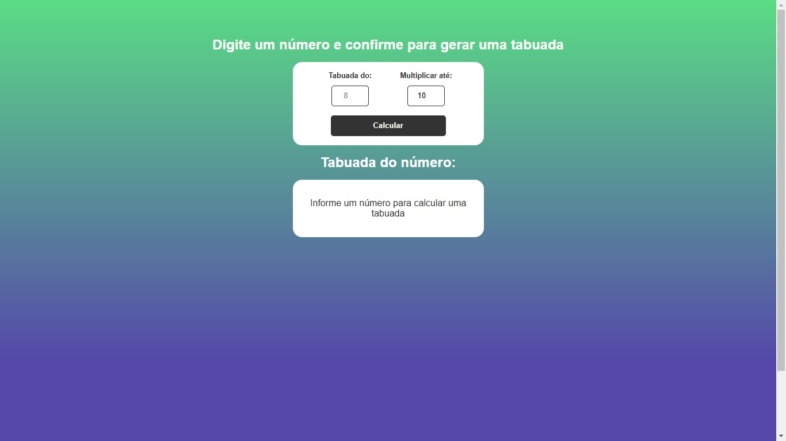
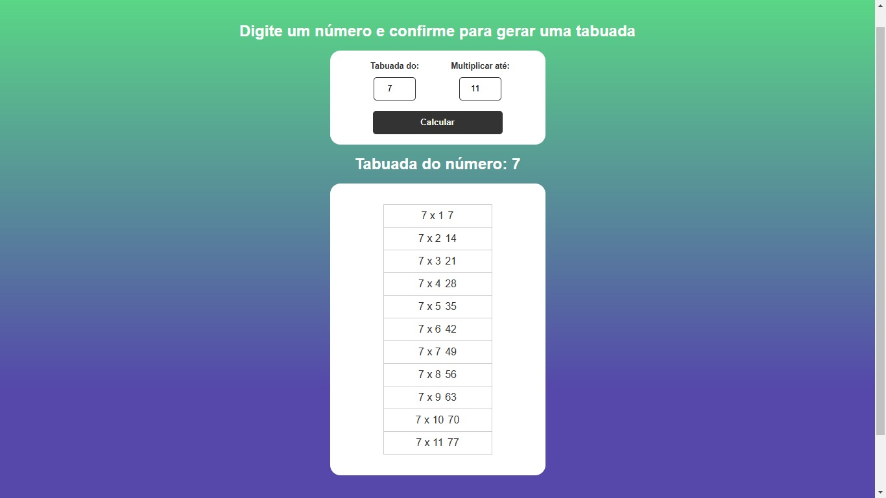

# Calculadora de multiplicação, feita com HTML, CSS e JavaScript.

## Este projeto foi desenvolvido durante o excelente curso do Hora de Codar!

> PrintScreen da tela exibindo o layout inicial da aplicação.

> PrintScreen da tela mostrando o layout após gerar o resultado.
